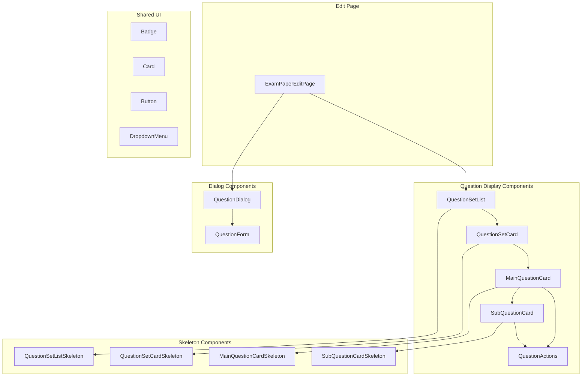

# Design Document

## Overview

This design refactors the exam paper edit page's question management system to improve UI/UX and code maintainability. The refactoring introduces a modular component architecture with dedicated components for QuestionSets, main questions, and sub-questions, along with skeleton loading states and a unified dialog system for question management.

The current implementation has all question display logic embedded in a single large file (`hierarchical-questions.tsx` at 1255 lines) and the edit page itself (`edit/page.tsx` at 2324 lines). This refactoring will:
1. Extract reusable components into separate files
2. Add skeleton loading components for better UX
3. Improve visual hierarchy with consistent styling
4. Consolidate dialog logic into a shared component

## Architecture



## Components and Interfaces

### QuestionSetList Component

The main container component that renders all question sets with loading states.

```typescript
interface QuestionSetListProps {
  questionSets: QuestionSetWithQuestions[];
  isLoading: boolean;
  onEditQuestion: (question: QuestionRead) => void;
  onDeleteQuestion: (questionId: string) => void;
  onAddSubQuestion: (parentId: string) => void;
  onEditQuestionSet: (questionSet: QuestionSetWithQuestions) => void;
  onDeleteQuestionSet: (questionSetId: string) => void;
  onAddQuestion: (questionSetId: string) => void;
  defaultExpanded?: boolean;
  onAnswersChange?: () => void;
}
```

### QuestionSetCard Component

Displays a single question set with its questions.

```typescript
interface QuestionSetCardProps {
  questionSet: QuestionSetWithQuestions;
  isExpanded: boolean;
  onToggleExpand: () => void;
  onEditQuestion: (question: QuestionRead) => void;
  onDeleteQuestion: (questionId: string) => void;
  onAddSubQuestion: (parentId: string) => void;
  onEditQuestionSet: () => void;
  onDeleteQuestionSet: () => void;
  onAddQuestion: () => void;
  onAnswersChange?: () => void;
}
```

### MainQuestionCard Component

Displays a main question with its sub-questions.

```typescript
interface MainQuestionCardProps {
  question: QuestionRead;
  subQuestions: QuestionRead[];
  isExpanded: boolean;
  onToggleExpand: () => void;
  onEdit: () => void;
  onDelete: () => void;
  onAddSubQuestion: () => void;
  onAnswersChange?: () => void;
}
```

### SubQuestionCard Component

Displays a sub-question with its answers.

```typescript
interface SubQuestionCardProps {
  question: QuestionRead;
  onEdit: () => void;
  onDelete: () => void;
  onAnswersChange?: () => void;
}
```

### QuestionActions Component

Shared dropdown menu for question actions.

```typescript
interface QuestionActionsProps {
  questionId: string;
  questionType: 'main' | 'sub';
  onView?: () => void;
  onEdit: () => void;
  onDelete: () => void;
  onAddSubQuestion?: () => void;
  isLoading?: boolean;
}
```

### QuestionDialog Component

Unified dialog for adding/editing questions.

```typescript
interface QuestionDialogProps {
  open: boolean;
  onOpenChange: (open: boolean) => void;
  mode: 'add-main' | 'add-sub' | 'edit';
  question?: QuestionRead;
  questionSets: QuestionSetWithQuestions[];
  selectedQuestionSetId?: string;
  parentQuestionId?: string;
  examPaperId: string;
  onSuccess: () => void;
}
```

### Skeleton Components

```typescript
interface QuestionSetListSkeletonProps {
  count?: number; // Default 3
}

interface QuestionSetCardSkeletonProps {
  questionCount?: number; // Default 2
}

interface MainQuestionCardSkeletonProps {
  subQuestionCount?: number; // Default 1
}

interface SubQuestionCardSkeletonProps {}
```

## Data Models

The components use existing API types from `src/types/generated/api.ts`:

```typescript
// From API - QuestionRead schema
interface QuestionRead {
  id: string;
  text: QuestionTextSchema | null;
  marks: number | null;
  numbering_style: NumberingStyleEnum;
  question_number: string;
  slug?: string | null;
  created_at: string;
  question_set_id?: string | null;
  exam_paper_id?: string | null;
  parent_id?: string | null;
  children: QuestionRead[] | null;
  answers: AnswerReadForQuestion[] | null;
  is_main_question: boolean | null;
  is_sub_question: boolean | null;
  children_count: number | null;
  answers_count: number | null;
  total_marks: number | null;
}

// Extended type for question sets with nested questions
interface QuestionSetWithQuestions {
  id: string;
  title?: string | null;
  slug?: string | null;
  questions?: QuestionRead[];
  questions_count?: number | null;
}

// Computed display data
interface QuestionSetDisplayData {
  mainQuestionsCount: number;
  totalQuestionsCount: number;
  totalMarks: number;
  hasUnansweredQuestions: boolean;
}
```

## Correctness Properties

*A property is a characteristic or behavior that should hold true across all valid executions of a system-essentially, a formal statement about what the system should do. Properties serve as the bridge between human-readable specifications and machine-verifiable correctness guarantees.*

### Property 1: Question count calculation accuracy
*For any* QuestionSet with questions, the displayed main question count SHALL equal the count of questions where `parent_id` is null, and the total question count SHALL equal the sum of main questions plus all their children.
**Validates: Requirements 1.4**

### Property 2: Marks calculation accuracy
*For any* QuestionSet, the displayed total marks SHALL equal the sum of `marks` property across all questions (main and sub) in that set.
**Validates: Requirements 1.5**

### Property 3: Skeleton count matches expected structure
*For any* loading state with a specified count, the skeleton component SHALL render exactly that number of skeleton items.
**Validates: Requirements 2.1, 2.3**

### Property 4: Dialog mode determines form state
*For any* dialog opening action, the dialog mode ('add-main', 'add-sub', 'edit') SHALL correctly set the form's initial state: add-main shows empty form with question set selector, add-sub shows empty form with parent pre-selected, edit shows form populated with question data.
**Validates: Requirements 3.1, 3.2, 3.3**

### Property 5: Dialog cancel resets state
*For any* dialog cancellation, the dialog SHALL close and all form state SHALL reset to initial values without triggering API calls.
**Validates: Requirements 3.5**

### Property 6: Component type matches question hierarchy
*For any* question in the display tree, questions with `parent_id === null` SHALL be rendered using MainQuestionCard, and questions with `parent_id !== null` SHALL be rendered using SubQuestionCard.
**Validates: Requirements 4.2, 4.3**

### Property 7: Expand toggle inverts state
*For any* expandable section (QuestionSet or MainQuestion), clicking the toggle SHALL invert the current expanded state (true becomes false, false becomes true).
**Validates: Requirements 5.1, 5.2**

### Property 8: Answer indicator accuracy
*For any* question, if `answers` array is empty or null, a warning indicator SHALL display; if `answers` array has items, a success indicator with the correct count SHALL display.
**Validates: Requirements 6.2, 6.3**

## Error Handling

### API Errors
- Display toast notification with error message
- Maintain current UI state (don't clear data on error)
- Log errors to console for debugging
- Provide retry option where applicable

### Loading States
- Show skeleton components during initial load
- Show inline spinners during actions (delete, save)
- Disable action buttons while operations are in progress

### Empty States
- Show helpful message when no question sets exist
- Show "Add Question" prompt when question set is empty
- Show "No answers yet" indicator on questions without answers

### Validation Errors
- Display inline validation messages in dialog form
- Prevent form submission until validation passes
- Highlight invalid fields with error styling

## Testing Strategy

### Unit Testing Framework
- **Framework**: Vitest with React Testing Library
- **Location**: `src/components/questions/__tests__/`

### Property-Based Testing
- **Framework**: fast-check
- **Minimum iterations**: 100 per property test
- **Focus areas**: Calculation functions, state transformations

### Test Categories

#### Unit Tests
- Component rendering with various props
- Event handler invocations
- Conditional rendering logic
- Accessibility attributes

#### Property-Based Tests
Each correctness property will have a corresponding property-based test:
- **Property 1**: Generate random question sets, verify count calculations
- **Property 2**: Generate questions with random marks, verify sum calculations
- **Property 3**: Generate random skeleton counts, verify render count
- **Property 4**: Generate dialog modes, verify form state initialization
- **Property 5**: Simulate cancel actions, verify state reset
- **Property 6**: Generate question trees, verify component type selection
- **Property 7**: Generate initial states, verify toggle behavior
- **Property 8**: Generate questions with/without answers, verify indicator display

### Test File Structure
```
src/components/questions/
├── __tests__/
│   ├── QuestionSetList.test.tsx
│   ├── QuestionSetCard.test.tsx
│   ├── MainQuestionCard.test.tsx
│   ├── SubQuestionCard.test.tsx
│   ├── QuestionDialog.test.tsx
│   ├── calculations.property.test.ts  # Properties 1, 2
│   ├── skeleton.property.test.ts      # Property 3
│   ├── dialog.property.test.ts        # Properties 4, 5
│   ├── hierarchy.property.test.ts     # Property 6
│   ├── expand.property.test.ts        # Property 7
│   └── indicators.property.test.ts    # Property 8
```

### Test Annotations
Each property-based test must include a comment referencing the design document:
```typescript
// **Feature: exam-edit-questions-refactor, Property 1: Question count calculation accuracy**
```
