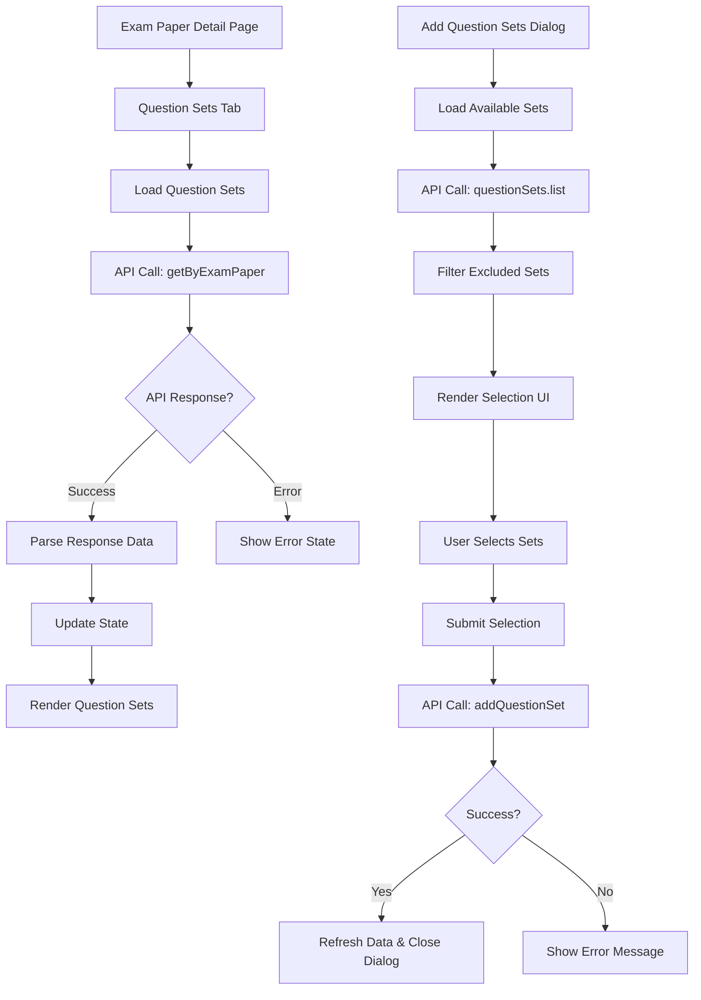

# Design Document

## Overview

This design addresses the critical issues in the exam paper question sets functionality by implementing robust data loading, consistent API integration, and improved error handling. The solution focuses on fixing the blank question sets display and ensuring the "Add Question Sets" dialog works correctly.

**Key Finding**: The exam paper details page uses the `QuestionSetSelector` component which works correctly, but the edit page uses a custom `AddQuestionSetDialog` component that may have issues. We need to either fix the custom dialog or standardize on the working `QuestionSetSelector` component.

## Architecture

### Current Issues Analysis

1. **Component Inconsistency**: Details page uses `QuestionSetSelector` (working) vs Edit page uses custom `AddQuestionSetDialog` (potentially broken)
2. **Data Loading Problems**: The `loadQuestionSetsWithCounts()` function may not be handling API responses correctly
3. **API Integration Issues**: Potential mismatch between expected and actual API response structures  
4. **State Management**: Inconsistent state updates between different question set data sources
5. **Error Handling**: Insufficient error handling leading to blank displays
6. **Dialog Functionality**: Custom dialog in edit page may not be calling correct API endpoints

### Proposed Solution Architecture



## Components and Interfaces

### 1. Enhanced Question Sets Loading

**Component**: `loadQuestionSetsWithCounts` function
**Purpose**: Reliably load and parse question sets data for an exam paper

**Interface**:
```typescript
interface QuestionSetWithCounts {
    id: string
    title: string | null
    slug?: string | null
    description?: string | null
    questions_count?: number
    exam_papers_count?: number
    created_at?: string
    updated_at?: string
}

async function loadQuestionSetsWithCounts(): Promise<void>
```

### 2. Improved API Response Handling

**Component**: Response parser utility
**Purpose**: Handle different API response structures consistently

**Interface**:
```typescript
interface APIResponse<T> {
    data?: {
        data?: {
            items?: T[]
        }
        items?: T[]
    } | T[]
    error?: any
}

function parseQuestionSetsResponse<T>(response: APIResponse<T>): T[]
```#
## 3. Enhanced Dialog State Management

**Component**: Question Sets Dialog
**Purpose**: Manage dialog state and API interactions reliably

**Interface**:
```typescript
interface DialogState {
    isOpen: boolean
    isLoading: boolean
    isSubmitting: boolean
    selectedIds: string[]
    availableSets: QuestionSetWithCounts[]
    error: string | null
}

interface DialogActions {
    openDialog: () => void
    closeDialog: () => void
    selectQuestionSet: (id: string) => void
    submitSelection: () => Promise<void>
    handleError: (error: any) => void
}
```

### 4. Unified Data Display Component

**Component**: Question Sets List
**Purpose**: Display question sets consistently regardless of data source

**Interface**:
```typescript
interface QuestionSetsListProps {
    questionSets: QuestionSetWithCounts[]
    isLoading: boolean
    error: string | null
    onUnlink: (id: string, name: string) => void
    onRefresh: () => void
}
```

## Data Models

### Question Set Data Model

```typescript
interface QuestionSetData {
    id: string
    title: string | null
    slug?: string | null
    description?: string | null
    questions_count?: number
    exam_papers_count?: number
    created_at?: string
    updated_at?: string
    // Additional fields that might be present in different API responses
    name?: string // Alternative to title
    question_count?: number // Alternative to questions_count
}
```

### API Response Models

```typescript
// Standard paginated response
interface PaginatedResponse<T> {
    data: {
        items: T[]
        total: number
        page: number
        size: number
    }
}

// Direct array response
interface DirectArrayResponse<T> {
    data: T[]
}

// Nested data response
interface NestedDataResponse<T> {
    data: {
        data: T[]
    }
}
```

## Error Handling

### Error Types and Handling Strategy

1. **Network Errors**: Connection failures, timeouts
   - Display user-friendly message
   - Provide retry mechanism
   - Log technical details for debugging

2. **API Errors**: 4xx/5xx HTTP responses
   - Parse error messages from API
   - Display specific error information
   - Handle authentication errors appropriately

3. **Data Parsing Errors**: Unexpected response structures
   - Implement fallback parsing strategies
   - Log structure mismatches for debugging
   - Gracefully degrade functionality

4. **State Management Errors**: Invalid state transitions
   - Reset to known good state
   - Prevent UI inconsistencies
   - Log state transition issues

### Error Recovery Mechanisms

```typescript
interface ErrorRecovery {
    retryOperation: () => Promise<void>
    fallbackToCache: () => void
    resetToInitialState: () => void
    reportError: (error: any) => void
}
```

## Testing Strategy

### Unit Tests
- API response parsing functions
- State management logic
- Error handling utilities
- Data transformation functions

### Integration Tests
- API endpoint interactions
- Dialog workflow end-to-end
- Data loading and display
- Error scenarios

### User Acceptance Tests
- Question sets display correctly
- Add question sets dialog works
- Error states are handled gracefully
- Loading states provide feedback

## Implementation Approach

### Phase 1: Fix Data Loading
1. Enhance `loadQuestionSetsWithCounts` function
2. Implement robust response parsing
3. Add comprehensive error handling
4. Test with different API response structures

### Phase 2: Fix Dialog Functionality
1. Review and fix API call implementations
2. Improve state management in dialog
3. Add proper loading and error states
4. Test add/remove operations

### Phase 3: Improve User Experience
1. Add better loading indicators
2. Implement success/error notifications
3. Improve empty states
4. Add retry mechanisms

### Phase 4: Data Consistency
1. Ensure consistent data updates
2. Implement proper cache invalidation
3. Add data validation
4. Test edge cases and error scenarios