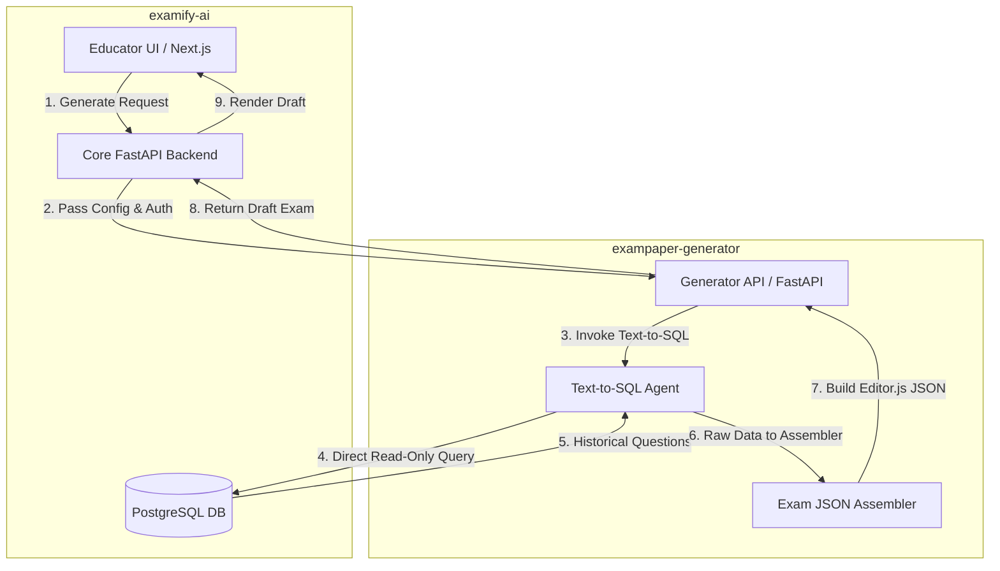

# examify.ai — Monorepo

> **The AI-powered past papers hub for African students and educators.**

Examify bridges the gap between students and quality exam resources by using RAG (Retrieval-Augmented Generation) to provide interactive, searchable past papers tied strictly to institutional syllabi.

---

## 🏗️ Repository Structure

This is the **company monorepo** for examify.ai. It contains three core services as Git submodules:

| Service | Directory | Description |
|---|---|---|
| **Backend API** | [`backend/`](./backend/) | FastAPI backend — REST API, auth, DB |
| **Frontend** | [`frontend/`](./frontend/) | Next.js frontend — student & educator portal, UI |
| **Parser** | [`parser/`](./parser/) | AI exam paper parser — PDF ingestion, OCR, structured extraction |
| **Exam Generator** | [`exampaper-generator/`](./exampaper-generator/) | Text-to-SQL AI service for intelligent exam synthesis |

---

## 🚀 Quick Start

### Clone with all submodules
```bash
git clone --recurse-submodules https://github.com/examify-ai/examify-ai.git
cd examify-ai
```

### Or, if you already cloned without submodules
```bash
git submodule update --init --recursive
```

### Update all submodules to latest
```bash
git submodule update --remote --merge
```

---

## 🛠️ Services

### Backend (`backend/`)
- **Tech:** FastAPI, PostgreSQL, Alembic, Docker
- **Repo:** [examify-ai/exampapel-fastapi-backend](https://github.com/examify-ai/exampapel-fastapi-backend)
- See [`backend/README.md`](./backend/README.md) for setup instructions

### Frontend (`frontend/`)
- **Tech:** Next.js, TypeScript, Tailwind CSS
- **Repo:** [examify-ai/exampapel-frontend](https://github.com/examify-ai/exampapel-frontend)
- See [`frontend/README.md`](./frontend/README.md) for setup instructions

### Parser (`parser/`)
- **Tech:** Python, Gemini AI, PDF processing
- **Repo:** [examify-ai/exam-paper-parser](https://github.com/examify-ai/exam-paper-parser)
- See [`parser/README.md`](./parser/README.md) for setup instructions

### Exam Generator (Standalone Service)
- **Tech:** FastAPI, LangChain, OpenAI/Claude (Text-to-SQL)
- **Repo:** Internal Module
- **See:** [`exampaper-generator/README.md`](./exampaper-generator/README.md) for technical specifications.
- **Role:** Handles intelligent exam paper synthesis by querying historical data via natural language.

---

## 📐 Architecture

The platform follows a microservices-inspired monorepo strategy, with core systems in this repository and specialized AI services handled externally.

### High-Level System Architecture



### Directory Map

```text
examify.ai
├── backend/              ← FastAPI REST API + PostgreSQL
├── exampaper-generator/  ← AI Text-to-SQL Service
├── frontend/             ← Next.js student/educator portal
└── parser/               ← PDF ingestion + AI-powered paper structuring
```

---

## 🏢 About examify.ai

Examify is a B2B/B2C EdTech startup targeting African higher education institutions.

- **B2B:** Reduce educator workload in exam creation — AI-assisted question generation from past papers
- **B2C:** Give students interactive, mobile-friendly access to past papers with AI study assistance

---

## 📬 Contact

- Website: [examify.ai](https://examify.ai)
- GitHub: [@examify-ai](https://github.com/examify-ai)
