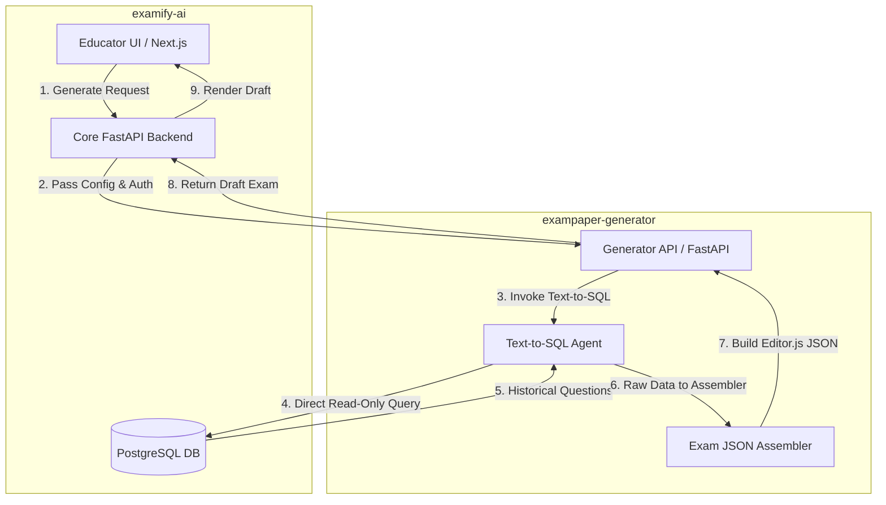

# 📑 AI Exam Generator Technical Specification

This document defines the architecture, data flow, and expected data models for the **AI Exam Generator**. 
This component is housed in a **completely separate monorepo** outside of the main `examify-ai` project. It acts as a standalone microservice that interfaces with the existing PostgreSQL database and FastAPI backend using a **Text-to-SQL** methodology.

---

## 1. System Architecture

By moving this to a dedicated monorepo (`exampaper-generator`), the application can be scaled independently and utilize its own isolated LLM environments, without bloating the main `examify-ai` backend.



### Infrastructure Components
- **Framework:** Python / FastAPI (lightweight, designed purely for AI task execution).
- **Text-to-SQL Engine:** LangChain's SQLDatabaseChain (or LlamaIndex) connected to a read-only PostgreSQL user.
- **LLM Provider:** OpenAI GPT-4o or Anthropic Claude 3.5 Sonnet.

---

## 2. Text-to-SQL Workflow

The Exam Generator bypasses vector embeddings (RAG). Instead, it deterministically queries the database.
1. The Educator requests a 50-mark "Hard" exam for "Data Structures".
2. The core backend sends this request to the Generator Monorepo.
3. The Text-to-SQL agent securely translates this into a Postgres query:
   ```sql
   SELECT text, marks FROM question q
   JOIN exam_paper_question_link eql ON q.question_set_id = eql.question_set_id
   JOIN exam_paper e ON eql.exam_id = e.id
   WHERE e.course_id = '<uuid>' AND q.marks >= 10
   ORDER BY RANDOM() LIMIT 5;
   ```
4. The retrieved questions are sent to a secondary LLM pipeline which perfectly structures them into an Editor.js JSON block.

---

## 3. Expected Data Models (Shared Contracts)

To ensure the new monorepo communicates seamlessly with the existing database and backend, it must expect and respect the following core models (simplified representations of the existing `SQLModel` schemas):

### 3.1 Input Parameter Model
Sent from the Core Backend to the Generator API.
```python
from pydantic import BaseModel
from typing import Optional
from uuid import UUID

class ExamGenerationRequest(BaseModel):
    institution_id: UUID
    course_id: UUID
    module_id: Optional[UUID]
    total_marks: int
    difficulty_level: str  # "Easy", "Medium", "Hard"
    numbering_style: str   # "roman", "alphabetic", "numeric"
    exam_title: str
    year_range: Optional[tuple[int, int]]  # e.g., (2018, 2024)
```

### 3.2 Expected Database Schema (Read-Only View)
The Text-to-SQL agent will be fed the exact schema of these tables to generate accurate queries:

**ExamPaper Table**
- `id` (UUID)
- `year_of_exam` (String)
- `course_id` (UUID)
- `institution_id` (UUID)

**QuestionSet Table**
- `id` (UUID)
- `title` (Enum: Question One, Question Two...)

**Question Table**
- `id` (UUID)
- `text` (JSONB - Editor.js blocks)
- `marks` (Integer)
- `numbering_style` (Enum)
- `question_set_id` (UUID)
- `parent_id` (UUID - for sub-questions)

### 3.3 Output Response Model
The exact payload the Generator returns to the Core Backend, ready to be rendered in the Educator's Next.js UI.
```python
class EditorJSBlock(BaseModel):
    id: str
    type: str # "header", "paragraph", "list"
    data: dict

class ExamGenerationResponse(BaseModel):
    status: str
    total_questions: int
    total_marks: int
    editor_js_payload: dict # Contains the 'time', 'blocks', and 'version'
```
